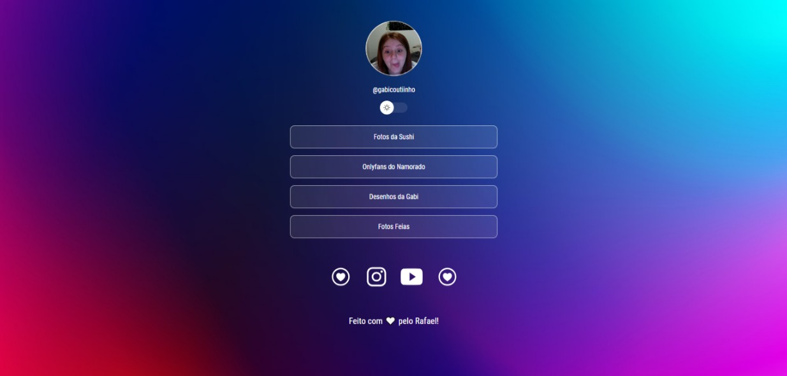
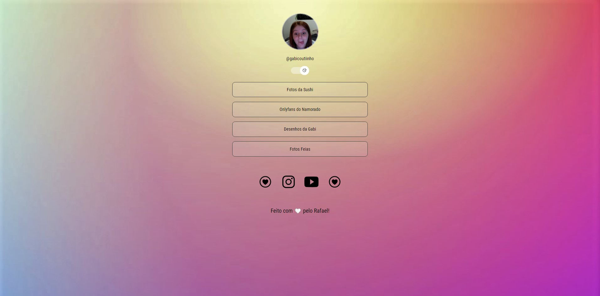

<h1 align="center"> Social Linking </h1>

 
Programa gratuito feito na intenção de estudar sobre HTML, CSS e Javascript.

 Tecnologias:
 
- HTML
 
- CSS
 
- Javascript

 
 Dark Mode 
 
 

  
 
 Light Mode 
 
 

 

