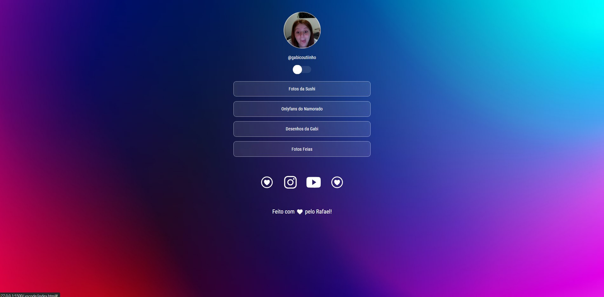

<h1 align="center"> Social Linking </h1>

 
Programa gratuito feito na intenção de estudar sobre HTML, CSS e Javascript.

 Projeto foi desenvolvido usando:
 
- HTML e CSS
 
- Javascript
 
- Git e Github
 
- Figma

 
 Dark Mode 
 
 

  
 
 Light Mode 
 
 

 

